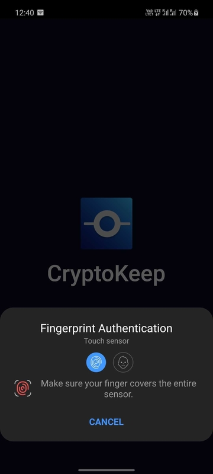
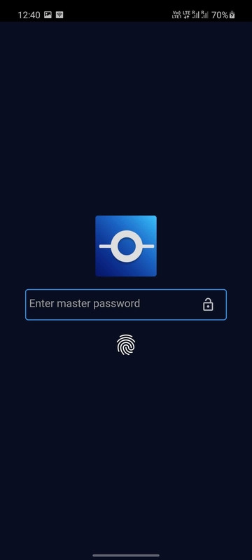
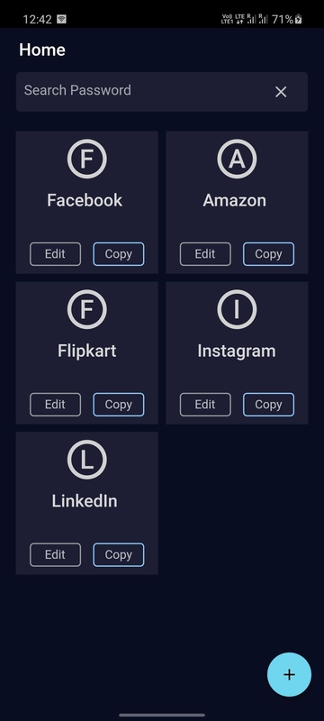
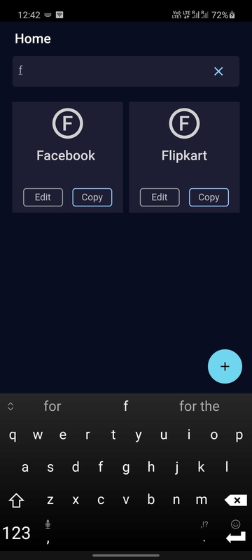
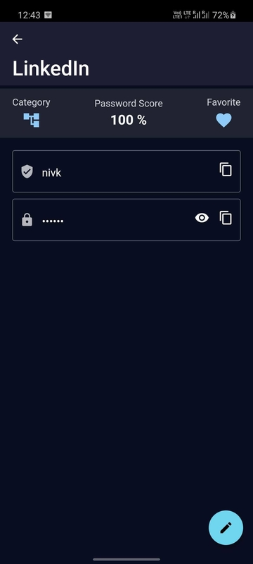
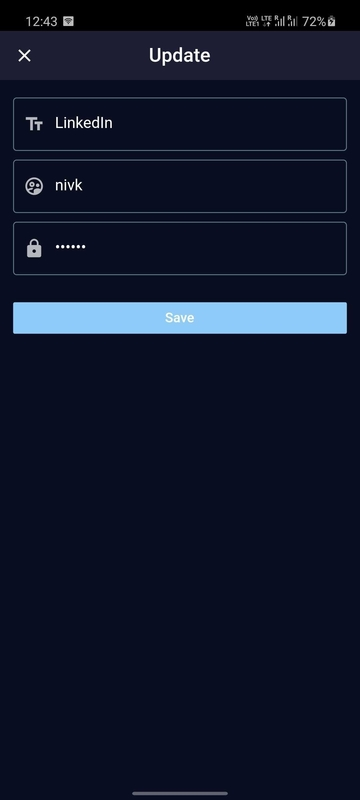

[](https://github.com/singhsaubhik/cryptokeep)


<br />

[![Amazon App Store][amazon-app-store-badge]][amazon-app-store-url]
[![Contributors][contributors-shield]][contributors-url]
[![Issues][issues-shield]][issues-url]
[![MIT License][license-shield]][license-url]


<!-- PROJECT LOGO -->
<br />
<p align="center">
  <a href="https://github.com/singhsaubhik/cryptokeep">
    
  </a>

  <h2 align="center">CryptoKeep</h2>

  <p align="center">
    An awesome password manager for all your password need.
    <br />
    <a href="https://github.com/singhsaubhik/cryptokeep">View Demo</a>
    ·
    <a href="https://github.com/singhsaubhik/cryptokeep/issues">Report Bug</a>
    ·
    <a href="https://github.com/singhsaubhik/cryptokeep/issues">Request Feature</a>
  </p>
</p>


<!-- ABOUT THE PROJECT -->
## About The Project

This is password manager for all your password needs, this stores your password locally by encrypting it. This is cross platform app built with Flutter to give you very native feel, but with awesome UI and better performance.


### Built With

* [Flutter](https://flutter.dev)
* [Dart](https://dart.dev/)
* [Material Design](https://material.io/design)

### Main Features
* Login with biometrics (fingerprints etc..)
* Save all your password locally, so no intrusion
* Encrypts all your password before saving into DB
* Material design for better user experience


## Screenshots

<br />
<br />

<br />
<br />

<br />
<br />

<br />
<br />

<br />
<br />



<br />


<!-- GETTING STARTED -->
## Getting Started

Configure project to run locally. Please follow below steps

### Prerequisites

You will need the following prerequisites to get started
* [Flutter](https://flutter.dev)
* You should not see any error with flutter doctor
  ```sh
  $ flutter doctor
  ```

### Installation

1. Clone the repo
   ```sh
   $ git clone https://github.com/singhsaubhik/cryptokeep.git
   ```
2. Install dependencies
   ```sh
   $ flutter pub get
   ```
4. Start Emulator / Simulator

4. Start app in debug mode
   ```sh
   $ flutter run
   ```


<!-- ROADMAP -->
## Roadmap

- [x] Login into app with biometrics on supported devices
- [ ] Support of creating and restoring backup
- [ ] Support for other platforms than Mobile (ie: Desktop)
- [ ] Save password on cloud (Firebase)
- [ ] Support dynamic theme for entire application (ie: Dark / Light)
- [ ] Add unit test

See the [open issues](https://github.com/singhsaubhik/cryptokeep/issues) for a list of proposed features (and known issues).


<!-- CONTRIBUTING -->
## Contributing

Contributions are what make the open source community such an amazing place to be learn, inspire, and create. Any contributions you make are **greatly appreciated**.

1. Fork the Project
2. Create your Feature Branch (`git checkout -b feature/AmazingFeature`)
3. Commit your Changes (`git commit -m 'Add some AmazingFeature'`)
4. Push to the Branch (`git push origin feature/AmazingFeature`)
5. Open a Pull Request


<!-- LICENSE -->
## License

Distributed under the The Unlicense License. See `LICENSE` for more information.


<!-- CONTACT -->
## Contact

#### Saubhik Singh
Twitter: [@singhsaubhik1](https://twitter.com/singhsaubhik1)
<br />
Email: saubhik.singh01@gmail.com


<!-- ACKNOWLEDGEMENTS -->
## Acknowledgements
* [GitHub Actions](https://github.com/features/actions)
* [Font Awesome](https://fontawesome.com/)

### Libraries / Packages
* [GetX](https://pub.dev/packages/get)
* [local_auth](https://pub.dev/packages/local_auth)
* [flutter_svg](https://pub.dev/packages/flutter_svg)
* [sqflite](https://pub.dev/packages/sqflite)
* [path_provider](https://pub.dev/packages/path_provider)
* [uuid](https://pub.dev/packages/uuid)
* [hive](https://pub.dev/packages/hive)


[contributors-shield]: https://img.shields.io/github/contributors/singhsaubhik/cryptokeep.svg?style=for-the-badge
[contributors-url]: https://github.com/singhsaubhik/cryptokeep/graphs/contributors
[issues-shield]: https://img.shields.io/github/issues/singhsaubhik/cryptokeep.svg?style=for-the-badge
[issues-url]: https://github.com/singhsaubhik/cryptokeep/issues
[license-shield]: https://img.shields.io/github/license/singhsaubhik/cryptokeep.svg?style=for-the-badge
[license-url]: https://github.com/singhsaubhik/cryptokeep/blob/master/LICENSE
[amazon-app-store-badge]: https://img.shields.io/badge/Amazon%20Developer-Store-blue.svg?&style=for-the-badge&logo=amazon-aws&logoColor=white
[amazon-app-store-url]: https://www.amazon.com/gp/product/B08Z7SFQZK
